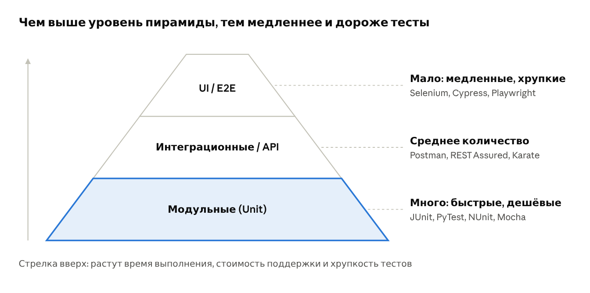

# Пирамида тестирования

## Цель урока

Понять принцип пирамиды тестирования Майка Кона и научиться распознавать антипаттерн «рожок мороженого».

## Принцип пирамиды

Майк Кон предложил пирамиду тестирования в книге «Succeeding with Agile» (2009). Она показывает, **сколько** тестов каждого уровня должно быть в проекте.

| Уровень | Количество | Свойства | Инструменты |
|---------|------------|----------|-------------|
| **UI / E2E** (вершина) | Мало | Медленные, хрупкие | Selenium, Cypress, Playwright |
| **Интеграционные / API** (середина) | Среднее | — | Postman, REST Assured, Karate |
| **Модульные / Unit** (основание) | Много | Быстрые, дешёвые | JUnit, PyTest, NUnit, Mocha |

**Чем выше уровень пирамиды, тем медленнее и дороже тесты**: растут время выполнения, стоимость поддержки и хрупкость.

## Почему именно так

- **Модульный тест** выполняется за миллисекунды, не требует окружения и при падении указывает точное место ошибки. Таких тестов можно иметь тысячи.
- **API-тест** проверяет бизнес-логику через программный интерфейс: медленнее модульного, но не зависит от вёрстки.
- **UI-тест** проходит весь сценарий через браузер. Он ближе всего к реальному пользователю, но занимает секунды и минуты и ломается от любого изменения интерфейса. Поэтому UI-тестами покрывают только критически важные сценарии.

## Порядок автоматизации

Пирамида задаёт и порядок работ:

1. Сначала — **модульные** тесты.
2. Затем — **API**-тесты.
3. И лишь потом — **критически важные пользовательские сценарии через UI**.

## Антипаттерн: «рожок мороженого»

Перевёрнутая пирамида, в которой **UI-тестов больше всего**, а модульных почти нет, называется «рожок мороженого» (ice-cream cone). Сверху часто ещё и «шарик» ручных проверок.

Такой набор тестов:

- **медленный** — полный прогон занимает часы, обратная связь приходит поздно;
- **постоянно ломается** — любое изменение вёрстки роняет десятки тестов;
- **плохо локализует ошибки** — упавший E2E-тест говорит «что-то сломалось», но не говорит, где.

Рожок обычно появляется, когда автоматизацию поручают только тестировщикам, а разработчики не пишут модульные тесты. Тестировщики автоматизируют то, что видят, то есть интерфейс.

## Главное

- В основании пирамиды — много быстрых модульных тестов, на вершине — немного UI-тестов.
- Чем выше уровень, тем медленнее, дороже и хрупче тесты.
- Перевёрнутая пирамида («рожок мороженого») — известный антипаттерн.

## Вопросы для самопроверки

1. Кто и когда предложил пирамиду тестирования?
2. В каком порядке стоит автоматизировать уровни пирамиды?
3. В проекте 400 UI-тестов и 30 модульных. Как называется такая ситуация и к чему она приводит?
